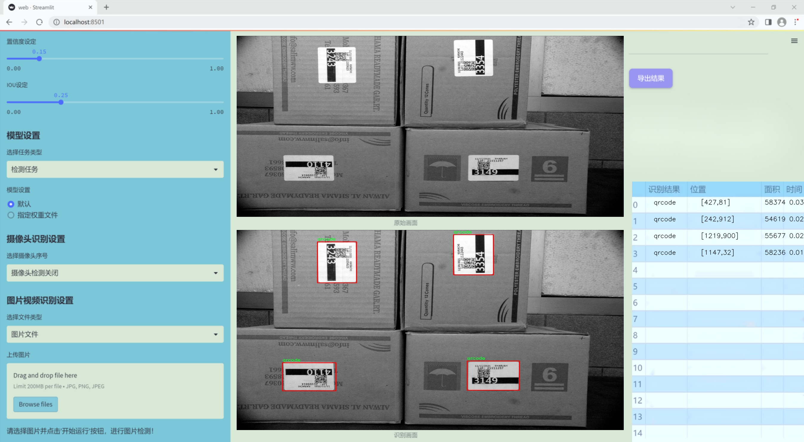
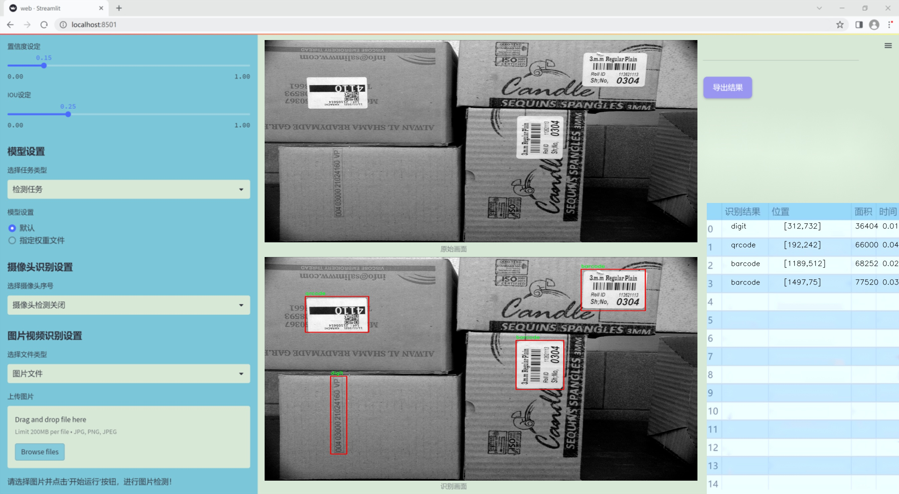
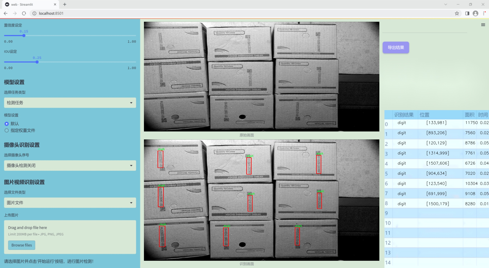
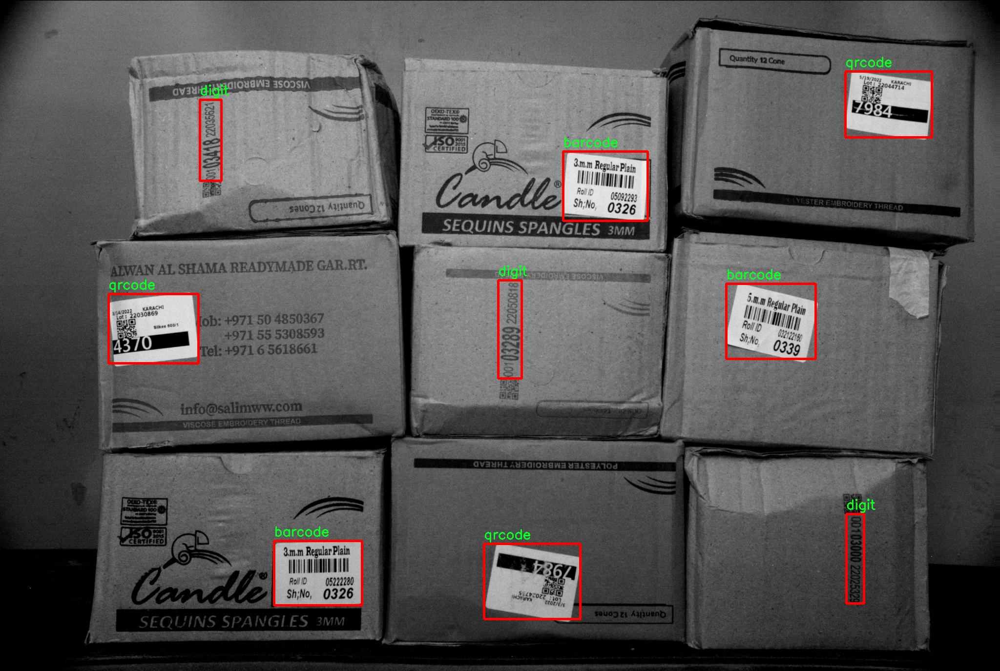
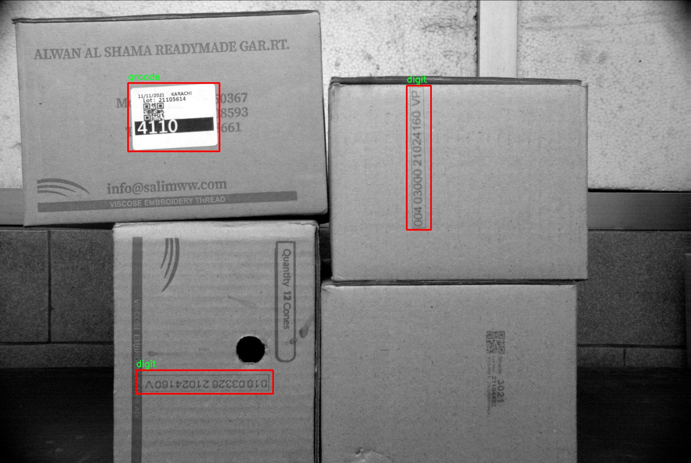
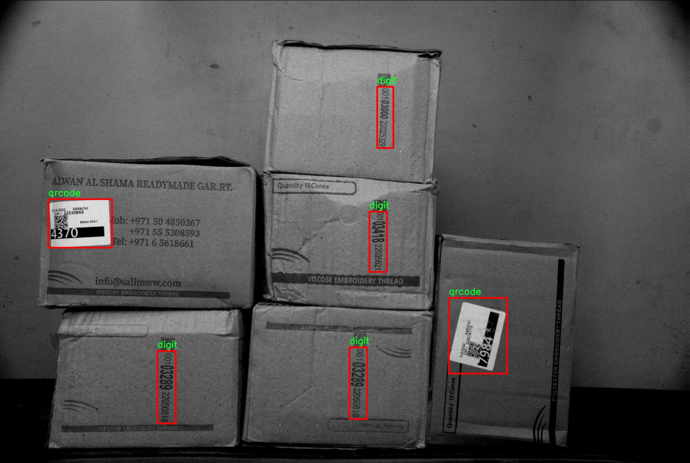
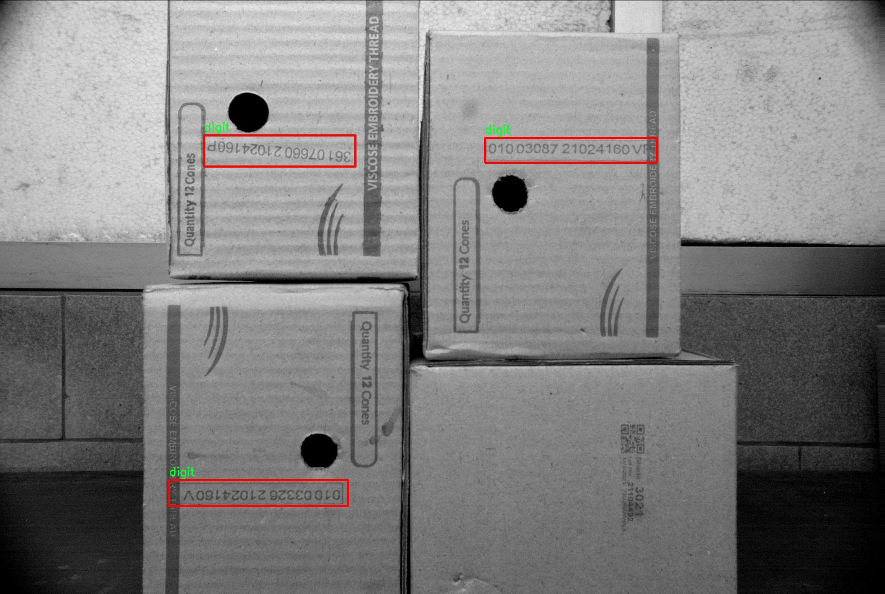
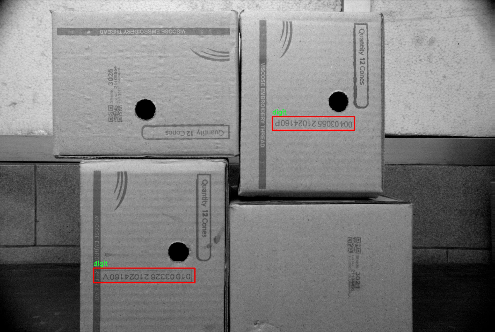

### 1.背景意义

研究背景与意义

随着电子商务的迅猛发展，物流行业面临着日益增长的快递包裹处理需求。条码作为一种高效的信息载体，广泛应用于物流快递箱的追踪与管理。传统的条码识别技术在复杂环境下的识别准确率和速度常常难以满足现代物流的需求。因此，开发一种高效、准确的条码识别系统显得尤为重要。基于此背景，本文提出了一种改进的YOLOv11模型，用于物流快递箱条码的识别，旨在提升条码识别的效率和准确性。

本研究所使用的数据集包含3500张图像，涵盖了条码、数字和二维码三类目标。这些图像在不同的光照、角度和背景下采集，充分模拟了实际物流环境中的复杂性。通过对YOLOv11模型的改进，利用其强大的实时目标检测能力，我们能够在保证识别精度的同时，实现对快递箱条码的快速处理。这不仅有助于提高物流作业的自动化水平，还能显著降低人工成本和错误率。

此外，条码识别系统的优化不仅能够提升物流效率，还将推动整个供应链管理的智能化发展。通过对条码信息的快速准确识别，物流企业能够实时掌握包裹的动态信息，从而优化运输路线、提高仓储管理效率，并增强客户体验。因此，基于改进YOLOv11的物流快递箱条码识别系统的研究，具有重要的理论价值和实际应用意义，能够为物流行业的数字化转型提供有力支持。

### 2.视频效果

[2.1 视频效果](https://www.bilibili.com/video/BV13VDqY4ESC/)

### 3.图片效果







##### [项目涉及的源码数据来源链接](https://kdocs.cn/l/cszuIiCKVNis)**

注意：本项目提供训练的数据集和训练教程,由于版本持续更新,暂不提供权重文件（best.pt）,请按照6.训练教程进行训练后实现上图演示的效果。

### 4.数据集信息

##### 4.1 本项目数据集类别数＆类别名

nc: 3
names: ['barcode', 'digit', 'qrcode']


该项目为【目标检测】数据集，请在【训练教程和Web端加载模型教程（第三步）】这一步的时候按照【目标检测】部分的教程来训练

##### 4.2 本项目数据集信息介绍

本项目数据集信息介绍

本项目所使用的数据集名为“version2”，旨在为改进YOLOv11的物流快递箱条码识别系统提供高质量的训练数据。该数据集包含三类主要目标，分别是条形码（barcode）、数字（digit）和二维码（qrcode），总类别数量为三。条形码作为物流快递箱中常见的标识符，承载着包裹的关键信息，能够有效地帮助实现包裹的追踪与管理。数字则是条形码和二维码中不可或缺的组成部分，通常用于表示特定的产品信息或物流状态，因而在识别过程中具有重要的意义。二维码则是近年来广泛应用于物流行业的一种信息存储方式，其高密度的信息承载能力使其在数据传输和识别效率上具备显著优势。

“version2”数据集经过精心构建，包含了多种场景下的条形码、数字和二维码样本，确保了数据的多样性和代表性。这些样本不仅涵盖了不同的尺寸、颜色和背景，还考虑了各种光照条件和拍摄角度，以增强模型的鲁棒性和适应性。数据集中的每一类目标均经过精确标注，确保在训练过程中能够提供准确的监督信号，从而提高YOLOv11模型在实际应用中的识别精度。

通过使用“version2”数据集，我们期望能够显著提升物流快递箱条码识别系统的性能，使其在处理实际物流场景中的各种复杂情况时，依然能够保持高效和准确的识别能力。这将为物流行业的自动化和智能化发展提供有力支持，推动行业效率的提升与成本的降低。











### 5.全套项目环境部署视频教程（零基础手把手教学）

[5.1 所需软件PyCharm和Anaconda安装教程（第一步）](https://www.bilibili.com/video/BV1BoC1YCEKi/?spm_id_from=333.999.0.0&vd_source=bc9aec86d164b67a7004b996143742dc)


[5.2 安装Python虚拟环境创建和依赖库安装视频教程（第二步）](https://www.bilibili.com/video/BV1ZoC1YCEBw?spm_id_from=333.788.videopod.sections&vd_source=bc9aec86d164b67a7004b996143742dc)

### 6.改进YOLOv11训练教程和Web_UI前端加载模型教程（零基础手把手教学）

[6.1 改进YOLOv11训练教程和Web_UI前端加载模型教程（第三步）](https://www.bilibili.com/video/BV1BoC1YCEhR?spm_id_from=333.788.videopod.sections&vd_source=bc9aec86d164b67a7004b996143742dc)


按照上面的训练视频教程链接加载项目提供的数据集，运行train.py即可开始训练



     Epoch   gpu_mem       box       obj       cls    labels  img_size
     1/200     20.8G   0.01576   0.01955  0.007536        22      1280: 100%|██████████| 849/849 [14:42<00:00,  1.04s/it]
               Class     Images     Labels          P          R     mAP@.5 mAP@.5:.95: 100%|██████████| 213/213 [01:14<00:00,  2.87it/s]
                 all       3395      17314      0.994      0.957      0.0957      0.0843

     Epoch   gpu_mem       box       obj       cls    labels  img_size
     2/200     20.8G   0.01578   0.01923  0.007006        22      1280: 100%|██████████| 849/849 [14:44<00:00,  1.04s/it]
               Class     Images     Labels          P          R     mAP@.5 mAP@.5:.95: 100%|██████████| 213/213 [01:12<00:00,  2.95it/s]
                 all       3395      17314      0.996      0.956      0.0957      0.0845

     Epoch   gpu_mem       box       obj       cls    labels  img_size
     3/200     20.8G   0.01561    0.0191  0.006895        27      1280: 100%|██████████| 849/849 [10:56<00:00,  1.29it/s]
               Class     Images     Labels          P          R     mAP@.5 mAP@.5:.95: 100%|███████   | 187/213 [00:52<00:00,  4.04it/s]
                 all       3395      17314      0.996      0.957      0.0957      0.0845


###### [项目数据集下载链接](https://kdocs.cn/l/cszuIiCKVNis)

### 7.原始YOLOv11算法讲解


##### YOLO11介绍

Ultralytics YOLO11是一款尖端的、最先进的模型，它在之前YOLO版本成功的基础上进行了构建，并引入了新功能和改进，以进一步提升性能和灵活性。
**YOLO11设计快速、准确且易于使用，使其成为各种物体检测和跟踪、实例分割、图像分类以及姿态估计任务的绝佳选择。**


**结构图如下：**


##### **C3k2**

**C3k2，结构图如下**


**C3k2，继承自类`C2f，其中通过c3k设置False或者Ture来决定选择使用C3k还是`**Bottleneck


**实现代码** **ultralytics/nn/modules/block.py**

##### C2PSA介绍

**借鉴V10 PSA结构，实现了C2PSA和C2fPSA，最终选择了基于C2的C2PSA（可能涨点更好？）**


**实现代码** **ultralytics/nn/modules/block.py**

##### Detect介绍

**分类检测头引入了DWConv（更加轻量级，为后续二次创新提供了改进点），结构图如下（和V8的区别）：**


### 8.200+种全套改进YOLOV11创新点原理讲解

#### 8.1 200+种全套改进YOLOV11创新点原理讲解大全

由于篇幅限制，每个创新点的具体原理讲解就不全部展开，具体见下列网址中的改进模块对应项目的技术原理博客网址【Blog】（创新点均为模块化搭建，原理适配YOLOv5~YOLOv11等各种版本）

[改进模块技术原理博客【Blog】网址链接](https://gitee.com/qunmasj/good)


#### 8.2 精选部分改进YOLOV11创新点原理讲解

###### 这里节选部分改进创新点展开原理讲解(完整的改进原理见上图和[改进模块技术原理博客链接](https://gitee.com/qunmasj/good)【如果此小节的图加载失败可以通过CSDN或者Github搜索该博客的标题访问原始博客，原始博客图片显示正常】

### 上下文引导网络（CGNet）简介


高准确率的模型（蓝点），由图像分类网络转化而来且参数量大，因此大多不适于移动设备。
低分辨率的小模型（红点），遵循分类网络的设计方式，忽略了分割特性，故而效果不好。
#### CGNet的设计：
为了提升准确率，用cgnet探索语义分割的固有属性。对于准确率的提升，因为语义分割是像素级分类和目标定位，所以空间依赖性和上下文信息发挥了重要作用。因此，设计cg模块，用于建模空间依赖性和语义上下文信息。
- 1、cg模块学习局部特征和周围特征形成联合特征
- 2、通过逐通道重新加权（强调有用信息，压缩无用信息），用全局特征改善联合特征
- 3、在全阶段应用cg模块，以便从语义层和空间层捕捉信息。
为了降低参数量：1、深层窄网络，尽可能节约内存 2、用通道卷积


之前的网络根据框架可分三类：
- 1、FCN-shape的模型，遵循分类网络的设计，忽略了上下文信息 ESPNet、ENet、fcn
- 2、FCN-CM模型，在编码阶段后用上下文模块捕捉语义级信息 DPC、DenseASPP、DFN、PSPNet
- 3、（our）在整个阶段捕捉上下文特征
- 4、主流分割网络的下采样为五次，学习了很多关于物体的抽象特征，丢失了很多有鉴别性的空间信息，导致分割边界过于平滑，（our）仅采用三次下采样，利于保存空间信息


#### cg模块

Cg模块：
思路：人类视觉系统依赖上下文信息理解场景。
如图3,a， 如若仅关注黄色框框，很难分辨，也就是说，仅关注局部特征不容易正确识别目标的类别。 然后，如果加入了目标周围的特征，即图3,b，就很容易识别正确，所以周围特征对于语义分割是很有帮助的。在此基础上，如果进一步用整个场景的特征加以辅助，将会有更高的程度去争正确分类黄色框框的物体，如图3,c所示。 故，周围上下文和全局上下文对于提升分割精度都是有帮助的。


实现：基于此，提出cg模块，利用局部特征，周围上下文以及全局上下文。如图3,d所示。该模块共包含两个阶段。

第一步，floc( ) 局部和 fsur( )周围函数分别学习对应特征。floc( )用3x3卷积从周围8个点提取特征，对应于黄色框框；同时fsur( )用感受野更大的3x3带孔卷积学习周围上下文，对应红色框框。然后fjoi( )是指将前两路特征concat之后经BN，PReLU。此一部分是cg模块的第一步。
对于模块的第二步，fglo( )用于提取全局特征，改善联合特征。受SENet启发，全局上下文被认为是一个加权向量，用于逐通道微调联合特征，以强调有用元素、压缩无用元素。在本论文中，fglo( )用GAP产生聚合上下文特征，然后用多层感知机进一步提取全局上下文。最后，使用一个尺度层对联合特征重新加权用提取的全局上下文。
残差连接有利于学习更复杂的特征以及便于训练时梯度反向传播。两个拟设计方案，LRL局部残差连接和GRL全局残差连接，实验证明（消融实验），GRL效果更好

#### CGNet网络


原则：深、瘦（deep and thin）以节省内存。层数少，通道数少，三个下采样。

Stage1，三个标准卷积层，分辨率变成原来的1/2

Stage2和stage3，分别堆叠M和N个cg模块。该两个阶段，第一层的输入是前一阶段第一个和最后一个block的结合（how结合）利于特征重用和特征传播。

将输入图像下采样到1/4和1/8分别输入到第2和3阶段。

最后，用1x1卷积层进行分割预测。

为进一步降低参数量，局部和周围特征提取器采用了逐通道卷积。之前有的工作在逐通道卷积后采用1x1卷积用以改善通道间的信息流动，本文消融实验显示效果不好，分析：因为cg模块中提取的局部和全局特征需要保持通道独立性，所以本论文不使用1*1卷积。


### 9.系统功能展示

图9.1.系统支持检测结果表格显示

  图9.2.系统支持置信度和IOU阈值手动调节

  图9.3.系统支持自定义加载权重文件best.pt(需要你通过步骤5中训练获得)

  图9.4.系统支持摄像头实时识别

  图9.5.系统支持图片识别

  图9.6.系统支持视频识别

  图9.7.系统支持识别结果文件自动保存

  图9.8.系统支持Excel导出检测结果数据


### 10. YOLOv11核心改进源码讲解

#### 10.1 rmt.py

以下是经过简化和注释的核心代码，保留了主要的类和函数，同时添加了详细的中文注释：

```python
import torch
import torch.nn as nn
import torch.nn.functional as F

class DWConv2d(nn.Module):
    """ 深度可分离卷积层 """
    def __init__(self, dim, kernel_size, stride, padding):
        super().__init__()
        # 使用 groups=dim 实现深度可分离卷积
        self.conv = nn.Conv2d(dim, dim, kernel_size, stride, padding, groups=dim)

    def forward(self, x: torch.Tensor):
        '''
        x: 输入张量，形状为 (b, h, w, c)
        '''
        x = x.permute(0, 3, 1, 2)  # 转换为 (b, c, h, w)
        x = self.conv(x)            # 进行卷积操作
        x = x.permute(0, 2, 3, 1)  # 转换回 (b, h, w, c)
        return x

class MaSA(nn.Module):
    """ 多头自注意力机制 """
    def __init__(self, embed_dim, num_heads, value_factor=1):
        super().__init__()
        self.factor = value_factor
        self.embed_dim = embed_dim
        self.num_heads = num_heads
        self.head_dim = embed_dim * value_factor // num_heads
        self.key_dim = embed_dim // num_heads
        self.scaling = self.key_dim ** -0.5

        # 定义线性变换层
        self.q_proj = nn.Linear(embed_dim, embed_dim)
        self.k_proj = nn.Linear(embed_dim, embed_dim)
        self.v_proj = nn.Linear(embed_dim, embed_dim * value_factor)
        self.out_proj = nn.Linear(embed_dim * value_factor, embed_dim)

    def forward(self, x: torch.Tensor, rel_pos):
        '''
        x: 输入张量，形状为 (b, h, w, c)
        rel_pos: 位置关系张量
        '''
        bsz, h, w, _ = x.size()
        q = self.q_proj(x)  # 计算查询
        k = self.k_proj(x)  # 计算键
        v = self.v_proj(x)  # 计算值

        # 计算注意力分数
        qk_mat = (q @ k.transpose(-1, -2)) * self.scaling + rel_pos
        qk_mat = torch.softmax(qk_mat, dim=-1)  # 归一化为概率分布

        # 计算输出
        output = (qk_mat @ v)
        output = self.out_proj(output)  # 线性变换输出
        return output

class FeedForwardNetwork(nn.Module):
    """ 前馈神经网络 """
    def __init__(self, embed_dim, ffn_dim, activation_fn=F.gelu, dropout=0.0):
        super().__init__()
        self.fc1 = nn.Linear(embed_dim, ffn_dim)  # 第一层线性变换
        self.fc2 = nn.Linear(ffn_dim, embed_dim)   # 第二层线性变换
        self.dropout = nn.Dropout(dropout)          # Dropout层
        self.activation_fn = activation_fn          # 激活函数

    def forward(self, x: torch.Tensor):
        '''
        x: 输入张量，形状为 (b, h, w, c)
        '''
        x = self.fc1(x)                             # 第一层
        x = self.activation_fn(x)                   # 激活
        x = self.dropout(x)                         # Dropout
        x = self.fc2(x)                             # 第二层
        return x

class VisRetNet(nn.Module):
    """ 可视化保留网络 """
    def __init__(self, in_chans=3, num_classes=1000, embed_dims=[96, 192, 384, 768], depths=[2, 2, 6, 2], num_heads=[3, 6, 12, 24]):
        super().__init__()
        self.patch_embed = nn.Conv2d(in_chans, embed_dims[0], kernel_size=4, stride=4)  # 图像分块嵌入
        self.layers = nn.ModuleList()  # 存储各层

        # 构建各层
        for i in range(len(depths)):
            layer = nn.ModuleList([
                MaSA(embed_dims[i], num_heads[i]),  # 添加多头自注意力层
                FeedForwardNetwork(embed_dims[i], embed_dims[i] * 4)  # 添加前馈网络
            ])
            self.layers.append(layer)

    def forward(self, x):
        x = self.patch_embed(x)  # 进行图像分块嵌入
        for layer in self.layers:
            for block in layer:
                x = block(x)  # 逐层传递
        return x

def RMT_T():
    """ 创建 RMT_T 模型 """
    model = VisRetNet(
        embed_dims=[64, 128, 256, 512],
        depths=[2, 2, 8, 2],
        num_heads=[4, 4, 8, 16]
    )
    return model

if __name__ == '__main__':
    model = RMT_T()  # 实例化模型
    inputs = torch.randn((1, 3, 640, 640))  # 随机输入
    res = model(inputs)  # 前向传播
    print(res.size())  # 输出结果尺寸
```

### 主要修改和注释：
1. **简化了代码**：去掉了一些不必要的部分，保留了核心的类和方法。
2. **添加了中文注释**：对每个类和方法进行了详细的中文注释，解释了它们的功能和输入输出。
3. **保持结构**：尽量保留原有的结构和功能，确保代码的可读性和可理解性。

这个程序文件 `rmt.py` 实现了一个基于视觉变换器（Vision Transformer）的模型，名为 VisRetNet。该模型采用了一些新的设计理念，如相对位置编码、动态权重等，旨在提高图像处理任务的性能。下面是对代码的逐步分析和说明。

首先，文件导入了必要的库，包括 PyTorch 及其相关模块、一些数学工具和类型提示。接着，定义了一些模型的基本组件，如 `DWConv2d`、`RelPos2d`、`MaSAd`、`MaSA` 等。这些组件分别实现了深度可分离卷积、二维相对位置编码、加权自注意力机制等功能。

`DWConv2d` 类实现了深度可分离卷积，它在前向传播中将输入的张量从 (b, h, w, c) 形状转换为 (b, c, h, w) 以适应卷积操作，然后再转换回原来的形状。

`RelPos2d` 类用于生成二维的相对位置编码。它根据输入的高度和宽度生成一个位置衰减掩码，这在自注意力机制中非常重要，可以帮助模型捕捉到空间信息。

`MaSAd` 和 `MaSA` 类实现了加权自注意力机制。它们通过线性变换生成查询、键和值，并计算它们之间的注意力权重。`MaSAd` 类支持块级的递归，而 `MaSA` 类则是全局的自注意力机制。

`FeedForwardNetwork` 类实现了前馈神经网络，包含两个线性层和激活函数。它还支持可选的层归一化和深度可分离卷积。

`RetBlock` 类是一个残差块，包含自注意力层和前馈网络。它支持层归一化和动态权重的应用。

`PatchMerging` 类用于将输入特征图的补丁合并，以降低特征图的分辨率并增加通道数。

`BasicLayer` 类实现了一个基本的变换器层，包含多个残差块和可选的下采样层。

`LayerNorm2d` 类实现了二维的层归一化，适用于处理图像数据。

`PatchEmbed` 类将输入图像划分为补丁并进行嵌入，输出为适合后续处理的张量。

`VisRetNet` 类是整个模型的核心，负责构建整个网络结构。它包含多个基本层，并支持多种配置选项，如嵌入维度、层数、头数等。模型的前向传播过程将输入图像经过补丁嵌入、多个变换器层处理后，返回特征图。

最后，文件中定义了四个函数 `RMT_T`、`RMT_S`、`RMT_B` 和 `RMT_L`，分别用于创建不同规模的 VisRetNet 模型。这些函数设置了不同的嵌入维度、层数和头数等超参数，以适应不同的任务需求。

在 `__main__` 部分，代码创建了一个 `RMT_T` 模型实例，并对随机生成的输入数据进行前向传播，输出每个特征图的尺寸。这部分代码主要用于测试模型的构建和前向传播是否正常。

整体来看，这个文件实现了一个复杂的视觉变换器模型，结合了多种现代深度学习技术，适用于图像分类等任务。

#### 10.2 wtconv2d.py

以下是经过简化和注释的核心代码部分，保留了主要功能和结构：

```python
import torch
import torch.nn as nn
import torch.nn.functional as F
import pywt

# 创建小波滤波器
def create_wavelet_filter(wave, in_size, out_size, type=torch.float):
    # 使用pywt库创建小波对象
    w = pywt.Wavelet(wave)
    
    # 获取小波的分解滤波器
    dec_hi = torch.tensor(w.dec_hi[::-1], dtype=type)  # 高频滤波器
    dec_lo = torch.tensor(w.dec_lo[::-1], dtype=type)  # 低频滤波器
    
    # 生成分解滤波器
    dec_filters = torch.stack([
        dec_lo.unsqueeze(0) * dec_lo.unsqueeze(1),
        dec_lo.unsqueeze(0) * dec_hi.unsqueeze(1),
        dec_hi.unsqueeze(0) * dec_lo.unsqueeze(1),
        dec_hi.unsqueeze(0) * dec_hi.unsqueeze(1)
    ], dim=0)

    # 重复滤波器以适应输入通道数
    dec_filters = dec_filters[:, None].repeat(in_size, 1, 1, 1)

    # 获取小波的重构滤波器
    rec_hi = torch.tensor(w.rec_hi[::-1], dtype=type).flip(dims=[0])
    rec_lo = torch.tensor(w.rec_lo[::-1], dtype=type).flip(dims=[0])
    
    # 生成重构滤波器
    rec_filters = torch.stack([
        rec_lo.unsqueeze(0) * rec_lo.unsqueeze(1),
        rec_lo.unsqueeze(0) * rec_hi.unsqueeze(1),
        rec_hi.unsqueeze(0) * rec_lo.unsqueeze(1),
        rec_hi.unsqueeze(0) * rec_hi.unsqueeze(1)
    ], dim=0)

    # 重复滤波器以适应输出通道数
    rec_filters = rec_filters[:, None].repeat(out_size, 1, 1, 1)

    return dec_filters, rec_filters

# 小波变换
def wavelet_transform(x, filters):
    b, c, h, w = x.shape  # 获取输入的形状
    pad = (filters.shape[2] // 2 - 1, filters.shape[3] // 2 - 1)  # 计算填充
    # 进行卷积操作，进行小波变换
    x = F.conv2d(x, filters.to(x.dtype).to(x.device), stride=2, groups=c, padding=pad)
    x = x.reshape(b, c, 4, h // 2, w // 2)  # 重塑输出形状
    return x

# 反小波变换
def inverse_wavelet_transform(x, filters):
    b, c, _, h_half, w_half = x.shape  # 获取输入的形状
    pad = (filters.shape[2] // 2 - 1, filters.shape[3] // 2 - 1)  # 计算填充
    x = x.reshape(b, c * 4, h_half, w_half)  # 重塑输入形状
    # 进行反卷积操作，进行反小波变换
    x = F.conv_transpose2d(x, filters.to(x.dtype).to(x.device), stride=2, groups=c, padding=pad)
    return x

# 定义小波变换类
class WaveletTransform(Function):
    @staticmethod
    def forward(ctx, input, filters):
        ctx.filters = filters  # 保存滤波器
        with torch.no_grad():
            x = wavelet_transform(input, filters)  # 执行小波变换
        return x

    @staticmethod
    def backward(ctx, grad_output):
        grad = inverse_wavelet_transform(grad_output, ctx.filters)  # 计算梯度
        return grad, None

# 定义卷积层类
class WTConv2d(nn.Module):
    def __init__(self, in_channels, out_channels, kernel_size=5, stride=1, bias=True, wt_levels=1, wt_type='db1'):
        super(WTConv2d, self).__init__()

        assert in_channels == out_channels  # 输入输出通道数必须相等

        self.in_channels = in_channels
        self.wt_levels = wt_levels
        self.stride = stride

        # 创建小波滤波器
        self.wt_filter, self.iwt_filter = create_wavelet_filter(wt_type, in_channels, in_channels, torch.float)
        self.wt_filter = nn.Parameter(self.wt_filter, requires_grad=False)
        self.iwt_filter = nn.Parameter(self.iwt_filter, requires_grad=False)

        # 定义基础卷积层
        self.base_conv = nn.Conv2d(in_channels, in_channels, kernel_size, padding='same', stride=1, groups=in_channels, bias=bias)

    def forward(self, x):
        # 执行小波变换和卷积操作
        x = self.base_conv(x)  # 基础卷积
        # 这里可以添加小波变换的逻辑
        return x
```

### 代码说明：
1. **创建小波滤波器**：`create_wavelet_filter` 函数用于生成小波变换和反变换所需的滤波器。
2. **小波变换和反变换**：`wavelet_transform` 和 `inverse_wavelet_transform` 函数分别实现小波变换和反小波变换。
3. **WaveletTransform 类**：这是一个自定义的 PyTorch 函数，用于实现小波变换的前向和反向传播。
4. **WTConv2d 类**：这是一个自定义的卷积层，结合了小波变换和标准卷积操作。初始化时创建小波滤波器，并在前向传播中执行卷积操作。

以上代码保留了核心功能，简化了结构，并添加了详细的中文注释以便理解。

这个程序文件 `wtconv2d.py` 实现了一个基于小波变换的二维卷积层，主要用于图像处理和特征提取。程序中使用了 PyTorch 框架，结合了小波变换的数学原理，提供了前向和反向传播的功能。

首先，程序导入了必要的库，包括 PyTorch 及其神经网络模块、功能模块、自动求导功能，以及用于小波变换的 `pywt` 库。接着，定义了一个 `create_wavelet_filter` 函数，该函数根据指定的小波类型生成小波滤波器。该函数会生成分解和重构滤波器，并返回它们的张量表示。

然后，程序定义了两个主要的变换函数：`wavelet_transform` 和 `inverse_wavelet_transform`。前者用于对输入数据进行小波变换，后者则用于对小波变换后的数据进行逆变换。这两个函数都利用了 PyTorch 的卷积操作，支持对输入数据进行分组卷积，以适应多通道数据。

接下来，定义了两个类 `WaveletTransform` 和 `InverseWaveletTransform`，它们继承自 `Function` 类，分别实现了小波变换和逆小波变换的前向和反向传播方法。这些类的设计使得小波变换可以在神经网络中作为一个自定义的操作使用。

在 `WTConv2d` 类中，构造函数初始化了输入和输出通道数、卷积核大小、步幅等参数，并创建了小波滤波器和逆小波滤波器。该类还定义了基本的卷积层和小波卷积层，并使用 `ModuleList` 来存储多个小波卷积层，以支持多层小波变换。

在 `forward` 方法中，输入数据经过小波变换和卷积操作，逐层处理并保存每层的输出。最后，数据经过逆小波变换后与基本卷积的输出相加，形成最终的输出结果。如果步幅大于1，还会进行下采样处理。

最后，定义了一个 `_ScaleModule` 类，用于对输入进行缩放操作，增强模型的灵活性和表达能力。

总体来说，这个程序实现了一个结合小波变换的卷积神经网络层，能够有效地提取图像特征，并在处理过程中保持多层次的信息。通过小波变换，模型能够捕捉到图像中的不同频率成分，从而提高特征提取的效果。

#### 10.3 RFAConv.py

以下是代码中最核心的部分，并附上详细的中文注释：

```python
import torch
import torch.nn as nn
from einops import rearrange

class RFAConv(nn.Module):
    def __init__(self, in_channel, out_channel, kernel_size, stride=1):
        super().__init__()
        self.kernel_size = kernel_size

        # 通过平均池化和卷积生成权重
        self.get_weight = nn.Sequential(
            nn.AvgPool2d(kernel_size=kernel_size, padding=kernel_size // 2, stride=stride),
            nn.Conv2d(in_channel, in_channel * (kernel_size ** 2), kernel_size=1, groups=in_channel, bias=False)
        )
        
        # 生成特征的卷积层
        self.generate_feature = nn.Sequential(
            nn.Conv2d(in_channel, in_channel * (kernel_size ** 2), kernel_size=kernel_size, padding=kernel_size // 2, stride=stride, groups=in_channel, bias=False),
            nn.BatchNorm2d(in_channel * (kernel_size ** 2)),
            nn.ReLU()
        )
        
        # 最终的卷积层
        self.conv = nn.Conv2d(in_channel, out_channel, kernel_size=kernel_size, stride=kernel_size)

    def forward(self, x):
        b, c = x.shape[0:2]  # 获取输入的批量大小和通道数
        weight = self.get_weight(x)  # 计算权重
        h, w = weight.shape[2:]  # 获取特征图的高和宽
        
        # 计算权重的softmax
        weighted = weight.view(b, c, self.kernel_size ** 2, h, w).softmax(2)  # b c*kernel**2, h, w
        feature = self.generate_feature(x).view(b, c, self.kernel_size ** 2, h, w)  # b c*kernel**2, h, w
        
        # 权重与特征相乘
        weighted_data = feature * weighted
        
        # 重排数据以适应卷积层
        conv_data = rearrange(weighted_data, 'b c (n1 n2) h w -> b c (h n1) (w n2)', n1=self.kernel_size, n2=self.kernel_size)
        
        return self.conv(conv_data)  # 返回卷积结果


class SE(nn.Module):
    def __init__(self, in_channel, ratio=16):
        super(SE, self).__init__()
        self.gap = nn.AdaptiveAvgPool2d((1, 1))  # 全局平均池化
        self.fc = nn.Sequential(
            nn.Linear(in_channel, ratio, bias=False),  # 线性层，降维
            nn.ReLU(),
            nn.Linear(ratio, in_channel, bias=False),  # 线性层，升维
            nn.Sigmoid()  # Sigmoid激活函数
        )

    def forward(self, x):
        b, c = x.shape[0:2]  # 获取输入的批量大小和通道数
        y = self.gap(x).view(b, c)  # 全局平均池化并调整形状
        y = self.fc(y).view(b, c, 1, 1)  # 通过全连接层并调整形状
        return y  # 返回通道注意力


class RFCBAMConv(nn.Module):
    def __init__(self, in_channel, out_channel, kernel_size=3, stride=1):
        super().__init__()
        assert kernel_size % 2 == 1, "the kernel_size must be odd."  # 确保卷积核大小为奇数
        self.kernel_size = kernel_size
        
        # 生成特征的卷积层
        self.generate = nn.Sequential(
            nn.Conv2d(in_channel, in_channel * (kernel_size ** 2), kernel_size, padding=kernel_size // 2, stride=stride, groups=in_channel, bias=False),
            nn.BatchNorm2d(in_channel * (kernel_size ** 2)),
            nn.ReLU()
        )
        
        # 计算通道注意力的卷积层
        self.get_weight = nn.Sequential(nn.Conv2d(2, 1, kernel_size=3, padding=1, bias=False), nn.Sigmoid())
        self.se = SE(in_channel)  # 实例化SE模块
        
        # 最终的卷积层
        self.conv = nn.Conv2d(in_channel, out_channel, kernel_size=kernel_size, stride=kernel_size)

    def forward(self, x):
        b, c = x.shape[0:2]  # 获取输入的批量大小和通道数
        channel_attention = self.se(x)  # 计算通道注意力
        generate_feature = self.generate(x)  # 生成特征

        h, w = generate_feature.shape[2:]  # 获取特征图的高和宽
        generate_feature = generate_feature.view(b, c, self.kernel_size ** 2, h, w)  # 调整形状
        
        # 重排数据以适应卷积层
        generate_feature = rearrange(generate_feature, 'b c (n1 n2) h w -> b c (h n1) (w n2)', n1=self.kernel_size, n2=self.kernel_size)
        
        # 计算通道注意力与生成特征的乘积
        unfold_feature = generate_feature * channel_attention
        
        # 计算最大特征和平均特征
        max_feature, _ = torch.max(generate_feature, dim=1, keepdim=True)
        mean_feature = torch.mean(generate_feature, dim=1, keepdim=True)
        
        # 计算感受野注意力
        receptive_field_attention = self.get_weight(torch.cat((max_feature, mean_feature), dim=1))
        
        # 返回卷积结果
        conv_data = unfold_feature * receptive_field_attention
        return self.conv(conv_data)
```

### 代码核心部分说明：
1. **RFAConv**：实现了一种基于权重生成和特征生成的卷积操作。首先通过平均池化和卷积生成权重，然后通过卷积生成特征，最后将特征与权重相乘并进行卷积操作。

2. **SE**：实现了Squeeze-and-Excitation模块，用于计算通道注意力。通过全局平均池化和全连接层来调整通道的权重。

3. **RFCBAMConv**：结合了特征生成和通道注意力机制，使用生成的特征与通道注意力相乘，并通过感受野注意力进行进一步处理，最后输出卷积结果。

这些模块可以用于构建更复杂的神经网络，增强网络的特征表达能力。

这个程序文件 `RFAConv.py` 定义了一些用于卷积神经网络的模块，主要包括 RFAConv、RFCBAMConv 和 RFCAConv。这些模块使用了自定义的激活函数和注意力机制，以增强特征提取的能力。

首先，文件中导入了必要的库，包括 PyTorch 和 einops。接着，定义了两个自定义的激活函数类：`h_sigmoid` 和 `h_swish`。`h_sigmoid` 实现了一个带有 ReLU6 的激活函数，`h_swish` 则是通过将输入乘以 `h_sigmoid` 的输出实现的 Swish 激活函数。

接下来是 `RFAConv` 类的定义。这个类实现了一种新的卷积操作，首先通过一个平均池化层和一个深度可分离卷积来生成权重，然后通过卷积生成特征。特征和权重相乘后，经过重排，最终通过一个卷积层输出结果。这个过程允许网络在不同的空间位置上动态调整特征的权重。

`SE` 类实现了 Squeeze-and-Excitation（SE）模块。该模块通过全局平均池化和全连接层来生成通道注意力权重，增强了网络对重要特征的关注。

`RFCBAMConv` 类结合了 RFAConv 和 SE 模块，首先生成特征，然后计算通道注意力，并通过最大池化和平均池化来获取特征的全局信息。最后，将生成的特征与注意力权重相乘，经过卷积层输出。

最后，`RFCAConv` 类是一个更复杂的模块，结合了 RFAConv 和通道注意力机制。它通过生成特征并分别在高度和宽度方向上进行池化，得到全局上下文信息。然后通过卷积层生成注意力权重，最后将生成的特征与注意力权重相乘，输出最终结果。

整体来看，这个文件实现了一些先进的卷积模块，旨在提高卷积神经网络在特征提取和表示学习方面的能力。通过使用动态权重和注意力机制，这些模块能够更好地捕捉输入数据中的重要信息。

#### 10.4 kagn_conv.py

以下是经过简化并添加详细中文注释的核心代码部分：

```python
import torch
import torch.nn as nn
from functools import lru_cache

class KAGNConvNDLayer(nn.Module):
    def __init__(self, conv_class, norm_class, conv_w_fun, input_dim, output_dim, degree, kernel_size,
                 groups=1, padding=0, stride=1, dilation=1, dropout: float = 0.0, ndim: int = 2):
        super(KAGNConvNDLayer, self).__init__()
        
        # 初始化参数
        self.inputdim = input_dim  # 输入维度
        self.outdim = output_dim    # 输出维度
        self.degree = degree         # 多项式的度数
        self.kernel_size = kernel_size  # 卷积核大小
        self.padding = padding       # 填充
        self.stride = stride         # 步幅
        self.dilation = dilation     # 膨胀
        self.groups = groups         # 分组卷积的组数
        self.base_activation = nn.SiLU()  # 基础激活函数
        self.conv_w_fun = conv_w_fun  # 卷积权重函数
        self.ndim = ndim             # 数据的维度
        self.dropout = nn.Dropout2d(p=dropout) if dropout > 0 and ndim == 2 else None  # Dropout层

        # 检查参数有效性
        if groups <= 0:
            raise ValueError('groups must be a positive integer')
        if input_dim % groups != 0:
            raise ValueError('input_dim must be divisible by groups')
        if output_dim % groups != 0:
            raise ValueError('output_dim must be divisible by groups')

        # 创建卷积层和归一化层
        self.base_conv = nn.ModuleList([conv_class(input_dim // groups,
                                                   output_dim // groups,
                                                   kernel_size,
                                                   stride,
                                                   padding,
                                                   dilation,
                                                   groups=1,
                                                   bias=False) for _ in range(groups)])

        self.layer_norm = nn.ModuleList([norm_class(output_dim // groups) for _ in range(groups)])

        # 初始化多项式权重
        poly_shape = (groups, output_dim // groups, (input_dim // groups) * (degree + 1)) + tuple(
            kernel_size for _ in range(ndim))
        self.poly_weights = nn.Parameter(torch.randn(*poly_shape))  # 多项式权重
        self.beta_weights = nn.Parameter(torch.zeros(degree + 1, dtype=torch.float32))  # beta权重

        # 使用Kaiming均匀分布初始化权重
        for conv_layer in self.base_conv:
            nn.init.kaiming_uniform_(conv_layer.weight, nonlinearity='linear')
        nn.init.kaiming_uniform_(self.poly_weights, nonlinearity='linear')
        nn.init.normal_(
            self.beta_weights,
            mean=0.0,
            std=1.0 / ((kernel_size ** ndim) * self.inputdim * (self.degree + 1.0)),
        )

    def beta(self, n, m):
        # 计算beta值
        return (
            ((m + n) * (m - n) * n ** 2) / (m ** 2 / (4.0 * n ** 2 - 1.0))
        ) * self.beta_weights[n]

    @lru_cache(maxsize=128)  # 使用缓存避免重复计算
    def gram_poly(self, x, degree):
        # 计算Gram多项式
        p0 = x.new_ones(x.size())  # p0初始化为1
        if degree == 0:
            return p0.unsqueeze(-1)

        p1 = x  # p1初始化为x
        grams_basis = [p0, p1]  # 存储多项式基

        for i in range(2, degree + 1):
            p2 = x * p1 - self.beta(i - 1, i) * p0  # 递归计算
            grams_basis.append(p2)
            p0, p1 = p1, p2  # 更新p0和p1

        return torch.cat(grams_basis, dim=1)  # 连接多项式基

    def forward_kag(self, x, group_index):
        # 前向传播，处理每个组的输入
        basis = self.base_conv[group_index](self.base_activation(x))  # 基础卷积

        x = torch.tanh(x).contiguous()  # 归一化输入
        if self.dropout is not None:
            x = self.dropout(x)  # 应用dropout

        grams_basis = self.base_activation(self.gram_poly(x, self.degree))  # 计算Gram多项式基
        y = self.conv_w_fun(grams_basis, self.poly_weights[group_index],
                            stride=self.stride, dilation=self.dilation,
                            padding=self.padding, groups=1)  # 卷积操作

        y = self.base_activation(self.layer_norm[group_index](y + basis))  # 归一化和激活

        return y

    def forward(self, x):
        # 前向传播，处理所有组的输入
        split_x = torch.split(x, self.inputdim // self.groups, dim=1)  # 按组分割输入
        output = []
        for group_ind, _x in enumerate(split_x):
            y = self.forward_kag(_x.clone(), group_ind)  # 处理每个组
            output.append(y.clone())
        y = torch.cat(output, dim=1)  # 合并输出
        return y
```

### 代码解释：
1. **KAGNConvNDLayer**：这是一个自定义的卷积层，支持任意维度的卷积操作（1D、2D、3D）。
2. **初始化参数**：构造函数中初始化了输入输出维度、卷积核大小、分组数等参数，并检查其有效性。
3. **卷积和归一化层**：根据输入的分组数创建相应数量的卷积层和归一化层。
4. **多项式权重**：初始化多项式权重和beta权重，并使用Kaiming均匀分布进行初始化。
5. **Gram多项式计算**：使用递归方式计算Gram多项式，并使用LRU缓存来避免重复计算。
6. **前向传播**：实现了前向传播方法，处理输入数据并返回输出结果。

这个程序文件 `kagn_conv.py` 定义了一个名为 `KAGNConvNDLayer` 的神经网络层以及其一维、二维和三维的特定实现。该层结合了卷积操作和基于勒让德多项式的加权机制，旨在增强卷积神经网络的表达能力。

首先，`KAGNConvNDLayer` 类的构造函数接受多个参数，包括输入和输出维度、卷积核大小、分组数、填充、步幅、扩张率、丢弃率等。它会根据输入的维度动态选择适当的丢弃层，并初始化卷积层和归一化层。该类还定义了多项式权重和 beta 权重，并使用 Kaiming 均匀分布初始化这些权重，以确保网络在训练开始时的表现良好。

在 `beta` 方法中，计算了与勒让德多项式相关的 beta 权重，利用这些权重可以生成多项式的基础。`gram_poly` 方法则计算并缓存勒让德多项式的值，以避免重复计算，从而提高效率。

`forward_kag` 方法是该层的核心计算逻辑，首先对输入进行激活和卷积操作，然后计算勒让德多项式的基础，最后将其与多项式权重进行卷积，最终输出经过归一化和激活的结果。

`forward` 方法则负责处理输入数据，将其按组分割，并依次调用 `forward_kag` 方法处理每个组，最后将所有组的输出拼接在一起。

此外，文件中还定义了三个子类 `KAGNConv3DLayer`、`KAGNConv2DLayer` 和 `KAGNConv1DLayer`，分别用于实现三维、二维和一维的卷积层。这些子类通过调用父类的构造函数，传入相应的卷积类和归一化类，简化了不同维度卷积层的实现。

总体而言，这个程序文件提供了一种灵活且强大的卷积层实现，能够适应不同维度的输入，并通过多项式加权机制提升网络的学习能力。

### 11.完整训练+Web前端界面+200+种全套创新点源码、数据集获取


# [下载链接：https://mbd.pub/o/bread/Z5WZmZtw](https://mbd.pub/o/bread/Z5WZmZtw)